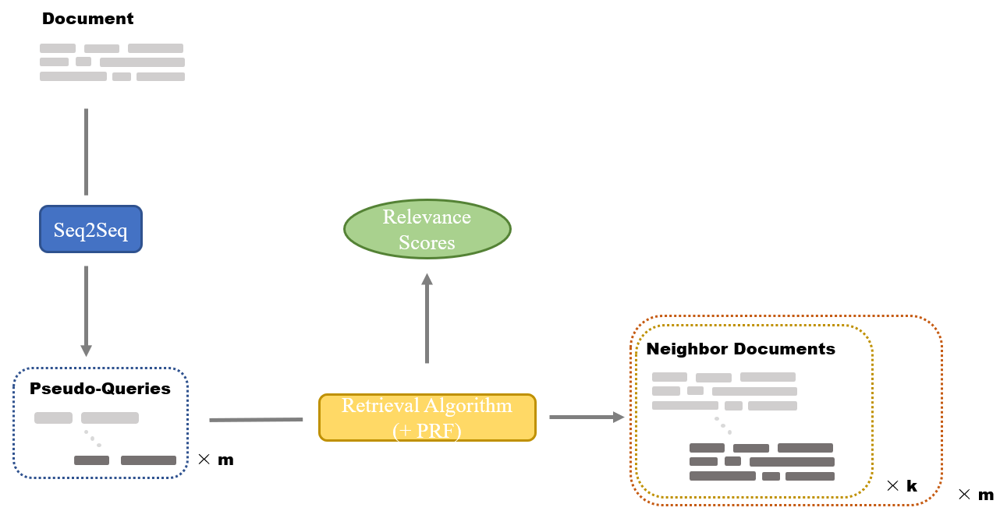
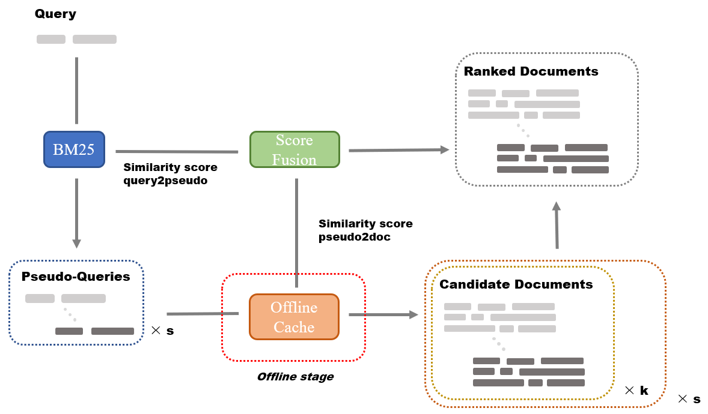

# OPRF

This repository contains the code and resources for our paper:

Xueru Wen, Xiaoyang Chen, Xuanang Chen, Ben He, Le Sun. Offline Pseudo Relevance Feedback for Efficient and Effective Single-pass Dense Retrieval. In SIGIR 2023.

## Installation

Our code is developed largely depend on [Pyserini](https://github.com/castorini/pyserini/).
There are two ways you may set up the environment needed for run:

- install pip requirements

```shell
conda create --name PPRF python=3.8.15
conda activate PPRF
pip install -r requirements.txt
```

- install exported conda environment

```shell
conda env create -f conda.yaml
```

## Usage

Following contents contains usage of our code for conducting experiments.

### Offline Preparation

The procedure of the offline preparation can be plotted as follows:


In our experiments, we utilized pseudo-queries generated by docT5query released on huggingface datasets, e.g. [castorini/msmarco_v1_passage_doc2query-t5_expansions](https://huggingface.co/datasets/castorini/msmarco_v1_passage_doc2query-t5_expansions).

1. Use [convert.py](source/convert.py) to download pseudo-queries and convert it into `.jsonl` format.
2. Following the [guidance](https://github.com/castorini/pyserini/blob/master/docs/usage-index.md#building-a-bm25-index-direct-java-implementation) in pyserini to build the BM25 index for further use.

### Online Retrieval

The procedure of the online retrieval can be plotted as follows:


[search.py](source/search.py) is the script to do the real searching process. 
Typical usage can be following:
```shell
python source\search.py --topic_name=dl19-passage \
 --num_pseudo_queries=4 \
 --num_pseudo_return_hits=1000 \
 --pseudo_name=msmarco_v1_passage_doc2query-t5_expansions_-1 \
 --pseudo_encoder_name=[castorini/unicoil-msmarco-passage,castorini/tct_colbert-v2-hnp-msmarco,sebastian-hofstaetter/distilbert-dot-tas_b-b256-msmarco] \
 --pseudo_doc_index=[msmarco-v1-passage-unicoil,msmarco-passage-tct_colbert-v2-hnp-bf,msmarco-passage-distilbert-dot-tas_b-b256-bf] \
 --pseudo_prf_depth=3 \
 --pseudo_prf_method=avg \
 --metrics=["nDCG@10","MAP","R@1000"] \
 --batch_size=200 \
 --device=cuda:0
```
For all models in the experiment are reused the implement in the pyserini.

## Reference

If you have any questions related to the code or the paper or the copyright, please email `wenxueru2022@iscas.ac.cn`. We would appreciate it if you cite our paper as following:

```
@inproceedings{wen2023offline,
  title={Offline Pseudo Relevance Feedback for Efficient and Effective Single-pass Dense Retrieval},
  author={Wen, Xueru and Chen, Xiaoyang and Chen, Xuanang and He, Ben and Sun, Le},
  booktitle={Proceedings of the 46th International ACM SIGIR Conference on Research and Development in Information Retrieval},
  pages={2209--2214},
  year={2023}
}
```